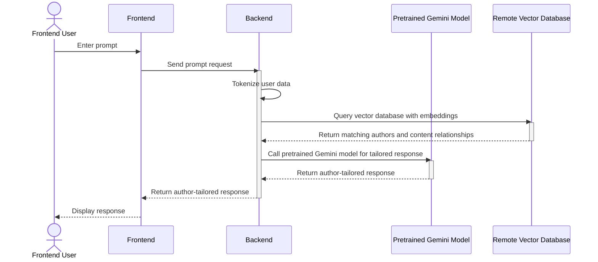
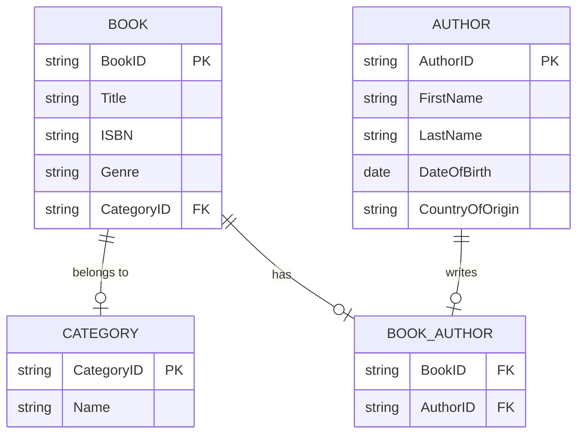

# IS215 Final Project - *Kinokuniya Timeless Conversations Web App*

Made by IS215 G11 Team 1.

## Team Members

* Astin Tay Wee Loon
* Gabriel Ong Zhe Mian
* Keith Tang Zi Heng
* Nicholas Lam Zhan Teng
* Nichole Bun Wen Xuan

## Screenshot

  
  

## Stack

* React
* ChromaDB
* GemeniAPI

## Architecture

### Overview

### DB

